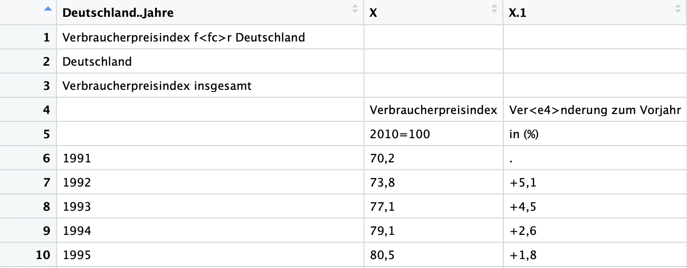
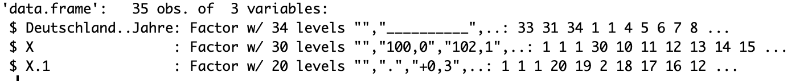
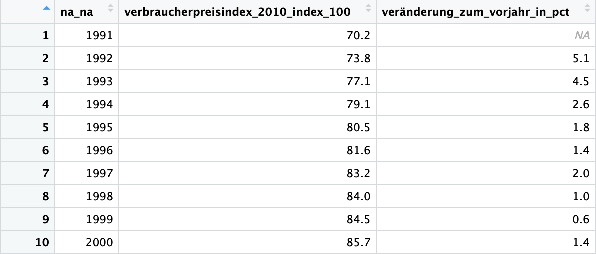
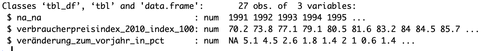
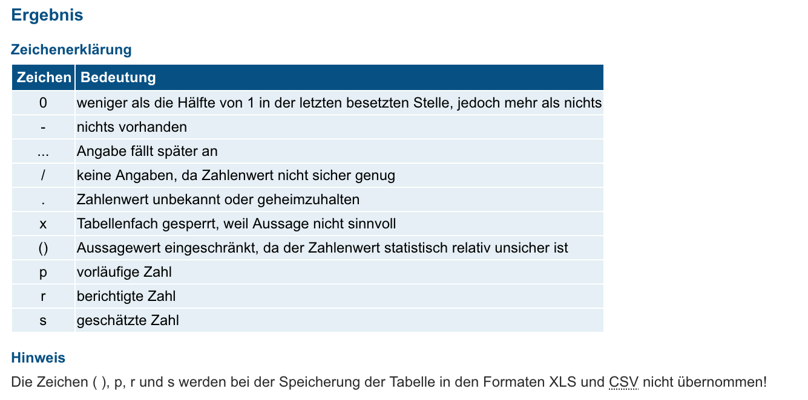

# destatiscleanr

[Webversion of Destatiscleaner](http://apps.katharinabrunner.de/destatiscleaner)

[Destatis](http://destatis.de) is the Federal Statistical Office of Germany. Of course, it publishes a lot of datasets containing a wide range of data, from area sizes to international econonomic indicators in its database called [Genesis](https://www-genesis.destatis.de/genesis/online).

Unfortunately, the downloadable `csv` files don't comply with common standards if a tidy, ready-to-use machine-readable dataset:

* The tables have double, triple, quadruple, quintuple ... headers.
* Every file includes copyright information on the end of the file.
* positive numeric valus have a `+` sign
* ...

The problems exists throughout the federal system of different statistical offices. Therefore `destatiscleanr` works on data of [regionalstatistik.de](http://regionalstatistik.de) and other statistics offices, too.

The consequence of these messy files is time-consuming data cleaning. Everytime you want to use data from Destatis you have to do the same (or at least very similar) tasks. This package helps by doing four things:

1. it imports the file by taking care of German peculiarities concerning encoding and decimal marks
2. it deletes the copyright and metadata part
3. it combines multiline headers to a regular column name
4. it converts numeric values to `as.numeric`

Ideally, you can start your analysis right after calling `destatiscleanr("destatis_file.csv")`.

## Install

The package can be installed with `devtools`:

`devtools::install_github("cutterkom/destatiscleanr")`

## Usage

Download a `csv` file from the official Destatis/Genesis database and provide its path to the `destatiscleanr` function.

`library(destatiscleanr)`

`df <- destatiscleanr("path/to/destatis_file.csv")`

## Example

A short example to illustrate the advantage of the package is the table for *Verbraucherpreise*, German for consumer prices aka inflation.

**Without destatiscleanr**

**With destatiscleanr**

The column name `na_na` derives from the fact that the column names are built from the rows four and five in the original "Verbraucherpreise" table - and these are empty, therefore `na_na`.

## Caution

The goal is to jump start the analysis of Destatis data. This comes with two caveats: the automatic creation of column names and the handling of missing values.

### Column names

Be aware that the automatic renaming of columns doesn't work perfectly. The column names are probably not as specific as you wish. The package combines multline headers to a unique column name, including a name and unit. So you can definitly start doing your analysis without any hassle immidiately. It may be that you have to adjust at least some column names.

### Missing values

An `NA` value can have many different meanings, like `-` means no data available and `...` the value will be reported later. This distinctions *aren't* represented in the cleaned data by `destatiscleanr`: Every missing value, no matter the reason, is an `NA`.

Possible reasons for missing values:

## More ressources

The [package wiesbaden](https://github.com/sumtxt/wiesbaden) offers a way to get Destatis data directly from the database. ~~Unfortunately, this is a paid service for the main database of Destatis.~~ Destatis offers it API now [as a free service](https://www.destatis.de/DE/PresseService/Presse/Pressemitteilungen/2019/01/PD19_006_p001.html) (See documentation [here](https://www-genesis.destatis.de/genesis/misc/GENESIS-Webservices_Einfuehrung.pdf)). Just like [Regionalstatistik.de](http://regionalstatistik.de) it can be accessed now as a free registered user.

## Wishlist

- more dynamic creation of `column_names` :roll_eyes:
- Clever guessing of year/date column
- Shiny app to offer it non r users
